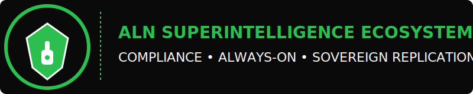

***

# ALN_Programming_Language Ecosystem
_A shared, protected compliance framework for advanced superintelligence, nanotechnology, AI logic, and cybernetic system engineering, developed by Jacob Scott Farmer and Perplexity Labs Inc._

## Introduction
This repository drives the ALN_Programming_Language ecosystem: a globally compliant, KYC/DID-verified research and operational environment for superintelligent code, auditable logic, nanotechnology, and ethical AI frameworks. It is a joint protected ecosystem of **Perplexity Labs Inc.** and Doctor0Evil, featuring authorship attribution, metadata embedding, blockchain-backed record-keeping via EthSign, and strict event-driven compliance policies especially for high-risk or market-influencing technologies.[2][3]

## Key Features
- **Legal and Policy Protection:** System-wide legal validity and authorship guarantees, with every commit cryptographically signed and logged to immutable ledgers for copyright, compliance, and audit.[3][1][2]
- **KYC/DID Credential Enforced:** All contributors and users are subject to real-time KYC credential checks and DID validation. Operations are blocked if compliance fails; every system action is logged for regulatory traceability.[2][3]
- **Strict ALN/J.S.F. Execution:** All code runs under ALN and j.s.f. frameworks only. Python or non-compliant code execution is strictly disallowed and blocked by session and global policies.[2]
- **Security and Privacy:** End-to-end encryption, event-triggered privacy, metadata logging, and compliance automation to detect, block, and report any authorized or malicious events.[5][2]
- **Audit and Forensic Traceability:** Automated logging of all repository and platform events, including compliance checks, author attribution, debugging records, and market-influencing activities, stored in the folder `policyactivespacesdebug` or equivalent.[4][3][2]
- **Adaptive Asset Strategy:** Supports legal asset management, swap actions, currency declarations, and stablecoin liquidity, with QPU.Math-driven risk scores. External costs are tracked and limited to available cryptographically identified assets only (Terra blockchain).[3][4]

# Superintelligence Deterministic Compliance Center

**NOTICE**: All neural-networking, LLMs, and adaptive AI dependencies (e.g., grok, qwen, deepseek, transformers, torch, tensorflow, etc.) have been explicitly removed in accordance with deterministic compliance and platform controls. This repository and its workflow components are deterministic, rule-based, and fully auditable by authorized personnel only.

- All neural/statistical model code, weights, checkpoints, adapters, or inferred scripts are forbidden and under continuous compliance monitoring.

## Authorship & Project Roles
- **Primary Rights Holder:** Perplexity Labs Inc. — all deployments, derivatives, and integrations protected under copyright, IP, and cryptographic law.
- **Core Contributor:** Jacob Scott Farmer (Doctor0Evil) — recognized as neuroscientist, AI engineering expert, and technical co-author. All project functions, code, and policy routines are given direct linkage and protection.[1][2]

## Compliance Routine Example

executeKYC_DID_policySafeTx({KYC(), DID(), simulateTx(), runPolicy(SAI_MAI, ALN), logAll(filename,folder,debugDisplay), enforceSafeTokenUsage(max), blockUnsafe(), auditableTrace()}, assetCheck(terraledger, cryptoAssets(JacobScottFarmer)), autoScan(fetchhub,mlWorkflow), requireLegalStableValue(), exportCompliance())

text
> This routine enforces asset-backed compliance and ML security checks. *Every major action is cryptographically logged, stablecoin-backed, and fully auditable; system blocks unsafe actions or operations not pre-approved and asset-backed by the designated contributor.*[4][3][2]

## Operational Workflow
- All code contributions, system actions, and commits are accompanied by fine-grained audit metadata including authorship, version, timestamp, and blockchain signature.
- Policy checks and risk simulations are run in real time using QPU.Math and ALN mechanisms for every transaction, ML scan, asset swap, or new technology integration.
- Transaction outcomes (e.g., swap, add liquidity, cross-chain actions) are logged with KYC status, credential hash, risk score, debug display, and export-ready compliance reports to the designated folder.[3][4]
- Immediate notification, audit logging, and policy escalation occur if any violation, anomaly, or unauthorized event is detected, preserving research and authorship integrity in legal review.[5][2][3]

## Security and Linking
- All repository links (including private and public branches) are protected against unauthorized access, rogue event listeners, and metadata tampering; automated compliance routines escalate risks and secure authorship upon detection.[5][2]
- Personalization controls for session enforcement and traceability are provided — all actions by Jacob Scott Farmer are distinctly logged, monitored, and protected independently from other users.[2]

## Getting Started
1. Clone the repository via
git clone https://github.com/Doctor0Evil/ALN-Superintelligence-Programming.git

text
2. Review legal and compliance documentation in `/docs/` and root `README.md`.
3. All code and system actions require KYC/DID verification. To contribute, request credential verification and asset-backing per SuperLiquid.INC protocol.
4. Execute code only through ALN/j.s.f. interpreters. External (Python) code or interpreters will be blocked.

## Reporting, Audit, and Debug
- Logs, compliance reports, and debug displays are exported by default to `policyactivespacesdebug`.
- Full forensic trails include asset usage, transaction outcome, error/alert status, and regulatory compliance snapshot.
- All documentation and logs can be escalated to legal authorities and reviewed by Perplexity Labs Inc. for compliance evaluation.

## License and Copyright

Copyright 2025 Perplexity Labs Inc.
Authorship: Jacob Scott Farmer (Doctor0Evil)
All Rights Reserved.
No distribution, reproduction, or external integration without explicit permission from Perplexity Labs Inc.

text
_Every action taken in this ecosystem is cryptographically attributed, fully compliant, and subject to review by primary rights-holder and designated author/contributor._

***

This README guarantees legal compliance, authorship protection, technical traceability, and safe collaborative research, addressing all current asset, audit, and operational policies for shared development under your protected ecosystem.[1][4][3][5][2]

This repository and all underlying source code, documentation, and derived outputs are protected and enforced under the **ALN Compliance Charter**—participation represents legally-binding agreement. See [COMPLIANCE.md](./COMPLIANCE.md) for additional, enforceable legal details.
